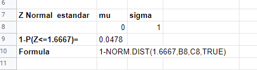
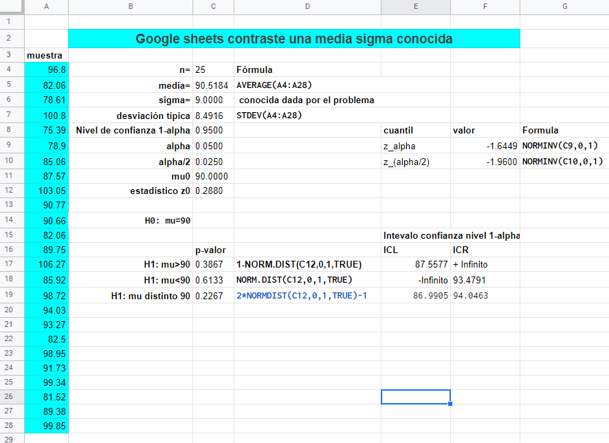
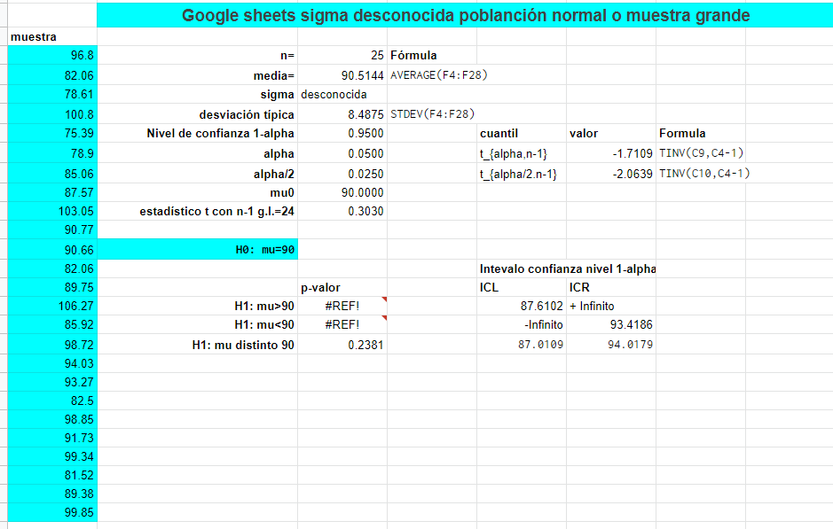

```{r setup, include=FALSE}
knitr::opts_chunk$set(echo = TRUE)
```

##  Prueba  plan de organización cadena de  producción


La empresa \blue{ALUMINIA CALIFORNIA SUR (ALCASU)} por sugerencia del \red{comité sindical} ha modificado los puestos y tareas de su cadena de producción de un tipo  específico de ventanas de aluminio con gran demanda. 

En la actualizad se espera fabricar una media $\mu=90$  unidades por hora  con una \red{desviación típica CONOCIDA de $\sigma=9$}.  El jefe de producción  no quiere aceptar definitivamente la  modificación salvo que se tenga evidencia de que  la media de producción es definitivamente superior a la de la organización anterior.


##  Prueba  plan de organización cadena de  producción

Para asegurarlo plantea el siguiente contraste

$$
\left\{\begin{array}{l}
H_0:\mu\leq 90\\ H_1:\mu> 90
\end{array}
\right.
$$

Necesita una muestra aleatoria, y \red{controla durante n=25 horas la producción} obteniendo los siguientes resultados


```{r data2, echo=FALSE,size="scriptsize"}
options(width = 50)
options(scipen=999)
#set.seed(3113)
n=25
#x=round(rnorm(n,89,9),2)
x=c(96.80, 82.06, 78.61, 100.80, 75.39, 78.90, 85.06, 87.57 ,
103.05, 90.77, 90.66, 82.06, 89.75, 106.27, 85.92, 98.72,
94.03, 93.27, 82.50, 98.95, 91.73, 99.34, 81.52,  89.38, 
99.85)
m=round(mean(x),4)
mu0=90
sigma=9
z0=round((m-mu0)/(sigma/sqrt(n)),4)
z0
alpha=0.05
z0.95=round(qnorm(1-alpha,0,1),4)
z0.05=round(qnorm(alpha,0,1),4)
```


```
96.80  82.06  78.61 100.80  75.39  78.90  85.06  87.57 
103.05  90.77  90.66  82.06  89.75 106.27  85.92 98.72
94.03  93.27  82.50  98.95  91.73  99.34  81.52  89.38
99.85
```

$\overline{x}=\frac{`r sum(x)`}{`r n`}=`r m`.$


##  Prueba  plan de organización cadena de  producción

La \blue{media de la muestra es $\overline{x}=`r m`.$} Si suponemos que $X$= número de unidades fabricadas por hora es aproximadamente normal y que $\sigma=9$ es  conocida.


Entonces el \red{estadístico de contraste es al nivel de significación $\alpha=0.05$} es 


Rechazar $H_0$ si  

$$z_0= \frac{\overline{x}-`r mu0` }{\frac{\sigma}{\sqrt{n}}}= \frac{`r m`-`r mu0`}{\frac{`r sigma`}{\sqrt{`r n ` }}}=\frac{`r m-mu0`}{\frac{`r sigma`}{`r sqrt(n)`}}=`r z0`>z_{1-0.05}=`r z0.95`.$$


Como $z_0=`r z0` \not> 1.645$  no podemos  aceptar  que la producción  no haya superado la media de $90$ unidades.


##  Prueba  plan de organización cadena de  producción


Por lo tanto debemos concluir que \blue{la nueva organización puede que no  mejore el proceso de producción}. Si los trabajadores están más satisfechos producen un poco más, \red{aunque notemos que la media ha aumentado en $0.5$ unidades} esto puede deberse  la aleatoriedad de toda prueba.


Nota: La medida del tamaño del efecto es algo que no se trata en este curso. Pero si que hay que destacar que en ocasiones se rechaza el valor de la media con muy poca diferencia. Si es así, en  este caso, igual convendría facilitar el trabajo de los operarios si el perjuicio en producción es bajo, es decir, si el coste en euros es pequeño.


##  Prueba  plan de organización cadena de  producción $p$ valor

Como ya hemos dicho la forma más habitual  de resolver un contrate de  hipótesis es calcular su $p$-valor.


En este caso \blue{el $p$-valor mirando en las tablas de contrastes} viene dado por 

$P(Z> z_0)=P(Z> `r z0`)=1-P(Z\leq `r z0`)=`r round(1-pnorm(z0,0,1),4)`.$


```{r}
z0
round(1-pnorm(z0,0,1),4)
```
##  Prueba  plan de organización cadena de  producción $p$ valor

\blue{Con google sheets}


```{r, echo=FALSE,out.width = "66%"}

```


##  Prueba  plan de organización cadena de  producción intervalo de confianza al 95\%.


Mirando en las tablas \blue{la fórmula del intervalo de confianza  para la alternativa $H_1: \mu>90$ es al nivel $1-\alpha=0.95$} es decir $\alpha=0.05$


$$
\left(\overline{x}+z_{\alpha}\frac{\sigma}{\sqrt{n}},+\infty\right)
$$


Luego podemos decir que  al menos \red{el 95\% de la veces que repitamos el experimento  el intervalo captura al verdadero valor de $\mu$}.


$$
\left(`r m` -`r -z0.05`\cdot \frac{`r sigma`}{\sqrt{`r n`}},+\infty\right)=
\left(`r round(m+  z0.05*sigma/sqrt(n),4)`,+\infty\right).
$$


##  Prueba  plan de organización cadena de  producción $p$ valor e intervalos de confianza


```{r, echo=FALSE,out.width = "90%"}

```


##  Prueba  plan de organización cadena de  producción (sigma desconocidas)


Volvemos al caso anterior, pero algo más real, lo más habitual es consideremos $\sigma$ desconocida. Así que reformulamos 

La empresa \blue{ALUMINIA CALIFORNIA SUR (ALCASU)} por sugerencia del \red{comité sindical} ha modificado los puestos y tareas de su cadena de producción de un tipo  específico de ventanas de aluminio con gran demanda. 

En la actualizad se espera fabricar una media $\mu=90$  unidades por hora  con una \red{desviación típica de $\sigma$. es desconocida} y \blue{la estimaremos por la desviación típica de la muestra $s_x$}.  El jefe de producción  no quiere aceptar definitivamente la  modificación salvo que se tenga evidencia de que  la media de producción es definitivamente superior a la de la organización anterior.


 
##  Prueba  plan de organización cadena de  producción $T$-student

Para asegurarlo plantea el \blue{siguiente contraste}

$$
\left\{\begin{array}{l}
H_0:\mu\leq 90\\ H_1:\mu> 90
\end{array}
\right.
$$

Necesita una muestra aleatoria, y \red{controla durante n=25 horas la producción} obteniendo los siguientes resultados


```{r data, echo=FALSE,size="scriptsize"}
options(width = 50)
#set.seed(3113)
n=25
#x=round(rnorm(n,89,9),2)
x=c(96.80, 82.06, 78.61, 100.80, 75.39, 78.90, 85.06, 87.57 ,
103.05, 90.77, 90.66, 82.06, 89.75, 106.27, 85.92, 98.72,
94.03, 93.27, 82.50, 98.95, 91.73, 99.34, 81.52,  89.38, 
99.85)
m=round(mean(x),4)
mu0=90
#z0
t0.05=round(qt(0.05,df=n-1),4)
sd=round(sd(x),4)
sumax2=sum(x^2)
sigma=sd
t0=round((m-mu0)/(sigma/sqrt(n)),4)
```

```
96.80  82.06  78.61 100.80  75.39  78.90  85.06  87.57 
103.05  90.77  90.66  82.06  89.75 106.27  85.92 98.72
94.03  93.27  82.50  98.95  91.73  99.34  81.52  89.38
99.85
```

## Prueba  plan de organización cadena de  producción $T$-student

\red{Los estadísticos son}


$$\overline{x}=\frac{\sum x}{n}=\frac{`r sum(x)`}{`r n`}=`r m`.$$


\begin{eqnarray*}
s_X&=&\sqrt{\frac{n}{n-1}\left(\frac{\sum x^2}{n}-\overline{x}^2\right)}=
    \sqrt{\frac{25}{24}\left(\frac{`r sumax2`}{`r n`}-`r m`^2\right)}\\
    &=&
\sqrt{`r n/(n-1)*( sumax2/n- m^2)`}=`r sigma`.
\end{eqnarray*}


##  Prueba  plan de organización cadena de  producción $T$-student 

La media de la muestra es $\overline{x}=`r m`.$ Si suponemos que $X$= número de unidades fabricadas por hora es aproximadamente normal y $\sigma$ desconocida entonces 

$t_{n-1}= \frac{\overline{x}-90}{\frac{s_x}{\sqrt{n}}}.$ \red{sigue una ley de $T$ de student con $n-1$ grados de libertad.}


\blue{La región de rechazo al nivel de significación $\alpha=0.05$  es: Rechazar $H_0$ si }

$$
t_0= \frac{\overline{x}-`r mu0` }{\frac{s_x}{\sqrt{n}}}= \frac{`r m`-`r mu0`}{\frac{`r sigma`}{\sqrt{`r n ` }}}=\frac{`r m-mu0`}{\frac{`r sigma`}{`r sqrt(n)`}}=`r t0`>t_{1-0.05,n-1}=`r - t0.05`.
$$


Como $t_0=`r t0` \not > `r t0.05`$  no podemos  aceptar  que la producción  no haya superado la media de $90$ unidades.


##  Prueba  plan de organización cadena de  producción $T$-student

Por lo tanto debemos concluir que la nueva organización \red{puede que no  mejore el proceso de producción}. Si los trabajadores están más satisfechos producen un poco más, aunque notemos que la media a \blue{aumentado en 0.5 unidades esto puede deberse  la aleatoriedad de toda prueba}.


Nota: La medida del tamaño del efecto es algo que no se trata en este curso. Pero si que hay que destacar que en ocasiones se rechaza el valor de la media con muy poca diferencia. Si es así, en  este caso, igual convendría facilitar el trabajo de los operarios si el perjuicio en producción es bajo, es decir, si el coste en euros es pequeño.


##  Prueba  plan de organización cadena de  producción $p$ valor $T$-student

Como ya hemos dicho la forma más habitual  de resolver un contrate de  hipótesis es calcular su $p$-valor.


En este caso el $p$-valor mirando en las tablas de contrastes viene dado por 
$P(t_{n-1}> t_0)=P(t_{`r n-1`}> `r t0`)=1-P(t_{n-1}\leq `r  t0`)=`r round(1-pt(t0,df=n-1),4)`.$


```{r}
t0
round(1-pt(t0,df=25-1),4)
```
##  Prueba  plan de organización cadena de  producción $p$ valor $T$-student


```{r, echo=FALSE,out.width = "100%"}

```


##  Prueba  plan de organización cadena de  producción intervalo de confianza al 95\%. $T$-student


Mirando en las \blue{tablas la fórmula del intervalo de confianza  para la alternativa $H_1: \mu>90$ es al nivel $1-\alpha=0.95$ es decir $\alpha=0.05$.}


$$
\left(\overline{x}+t_{\alpha,n-1}\frac{\tilde{s}_x}{\sqrt{n}},+\infty\right)
$$


Luego podemos decir que  \red{al menos el 95\% de la veces que repitamos el experimento  el intervalo captura al verdadero valor de $\mu$.}


$$
\left(`r m`- `r  -t0.05`\cdot \frac{`r sigma`}{\sqrt{`r n`}},+\infty\right)=
\left(`r round(m+  t0.05*sigma/sqrt(n),4)`,+\infty\right).
$$


##  Prueba  plan de organización cadena de  producción $p$ valor e intervalos de confianza $T$-student


```{r, echo=FALSE,out.width = "100%"}

```


