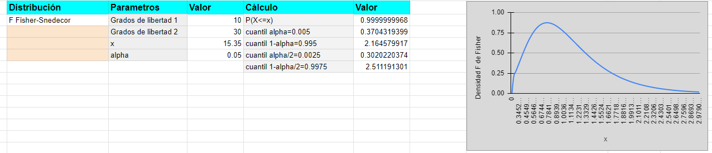

# La distribución $F$ de Fisher

## La distribución $F$ de Fisher

La distribución $F_{n,m}$ de Fisher, donde $n,m$ son los grados de libertad se define como el cociente de dos variables $\chi^2$ independientes de $n$ y $m$ grados de libertad, respectivamente:


$$F_{n,m}=\frac{\chi_{n}^2/n}{\chi_m^2/m}.$$
$$E(F_{n,m})=\frac{m}{m-2}\mbox{,  si } m>2.$$
$$Var(F_{n,m})=\frac{2\cdot m^2\cdot (n+m-2)}{n\cdot (m-2)^2\cdot (m-4)}\mbox{ , si } m>4.$$


## La distribución $F$ de Fisher


Su función de densidad tiene la siguiente expresión:
$$
f_{F_{n,m}}(x)=\frac{\Gamma\left(\frac{n+m}2\right)}{\Gamma\left(\frac{n}2\right)\Gamma\left(\frac{m}2\right)}\cdot
\left(\frac{n}{m}\right)^{n/2} \cdot x^{n/2-1}\cdot \left(1+\frac{n}{m}\cdot x\right)^{-(m+n)/2}
\mbox{, si } x\geq 0.
$$

donde $\Gamma(x)=\int_0^{\infty} t^{x-1}e^{-t}\, dt,$ si $x> 0$.


De la propia definición se deduce fácilmente que

$$F_{n,m}=\frac{\chi_{n}^2/n}{\chi_m^2/m}=\frac{1}{\frac{\chi_{m}^2/m}{\chi_n^2/n}}=\frac{1}{F_{m,n}}.$$

## La distribución $F$ de Fisher

Gráfica de la función de densidad de algunas distribuciones $F$ de Fisher.


```{r fplot,echo=FALSE}
curve(df(x, df1=1, df2=1), xlim = c(0, 5), ylim = c(0, 1),
      col = "black", ylab = "densidad", xlab = "x")
legend("topright",  legend = c("F n=1, m=1", "F n=2, m=2",
                              "F n=3, m=4", "F n=4, m=6",
                              "F n=5, m=10", "F n=6, m=12"),
       fill = c("black", "brown", "green", "tomato", 
                "pink", "darkblue"),cex = 0.8)
                curve(df(x, df1 = 2, df2=2), col = "brown", add = TRUE)
curve(df(x, df1 = 3, df2=4), col = "green", add = TRUE)
curve(df(x, df1 = 4, df2=6), col = "tomato", add = TRUE)
curve(df(x, df1 = 5, df2=10), col = "pink", add = TRUE)
curve(df(x, df1 = 6, df2=12), col = "darkblue", add = TRUE)
```

## Ejemplo de cálculo con R de una $F$ de Fisher $F_{n,m}$


Consideremos una $F$ de Fisher $F_{n=5,m=10}$

$P(F_{5,10}\leq 8)$   y  cuantil $x_{\alpha=0.05}$  se calculan así  


```{r}
pf(8,df1 = 5,df2=10)
qf(0.05,df1 = 5,df2=10)
```

## Ejemplo de cálculo con R de una $F$ de Fisher $F_{n,m}$

su densidad   en $x=8$ es  

$$f_{5,10}(8)=\frac{\Gamma\left(\frac{5+10}2\right)}{\Gamma\left(\frac{5}2\right)\Gamma\left(\frac{10}2\right)}\cdot
\left(\frac{5}{10}\right)^{5/2} \cdot 8^{5/2-1}\cdot \left(1+\frac{5}{10}\cdot 8\right)^{-(5+10)/2}.
$$

```{r}
df(8,df1=5,df2=10)
gamma((5+10)/2)/(gamma(5/2)*gamma(10/2))*(5/10)^(5/2)*8^(5/2-1)*(1+5/10*8)^(-(10+5)/2)
```


## Ejemplo de cálculo $F$ de Fisher $F_{n,m}$ con una hoja de cálculo

```{r fisher_captura,echo=FALSE}

```


## Curiosidades de la función $\Gamma$.


$\Gamma(n+1)=n!=1\cdot 2\cdot \ldots\cdot n$

$\Gamma\left(\frac{1}{2}\right)=+\sqrt{\pi}.$

```{r}
n=c(1,2,3,4,5)
factorial(n)
gamma(n+1)
gamma(1/2)
sqrt(pi)
gamma(1/2)
sqrt(pi)
```


## Curiosidades de la distribución $F_{n,m}$.

$$
\begin{eqnarray*}
P(F_{5,10}\leq 8)&=& P\left(\frac{1}{F_{5,10}} \geq \frac{1}{8}\right)=1-P\left(\frac{1}{F_{5,10}} \leq \frac{1}{8}\right)\\&=& 1-P\left(F_{10,8}\leq \frac{1}{8}\right).
\end{eqnarray*}
$$

```{r}
pf(8,df1=5,df2=10)
1-pf(1/8,df1=10,df2=5)
```


